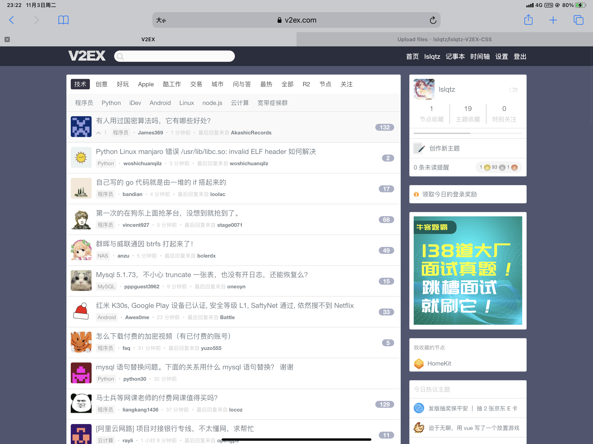
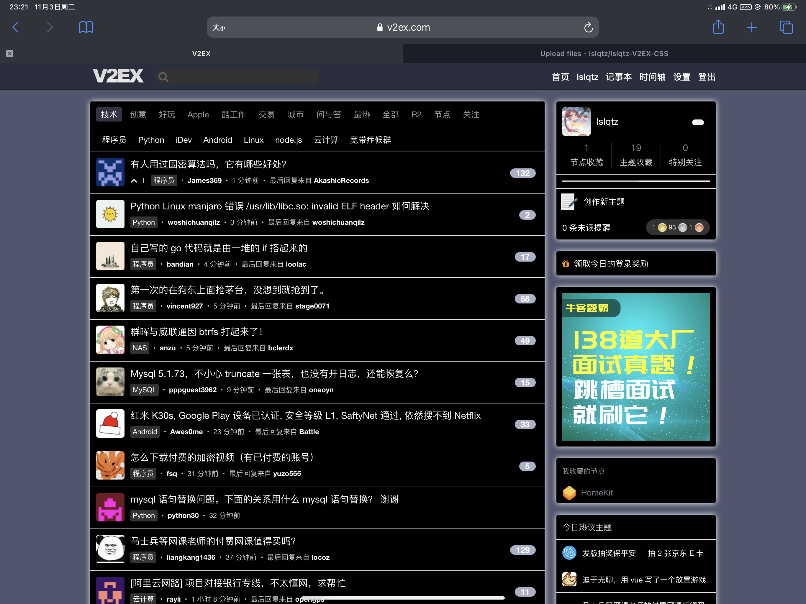
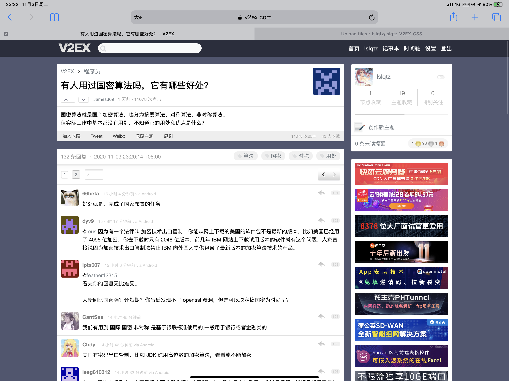
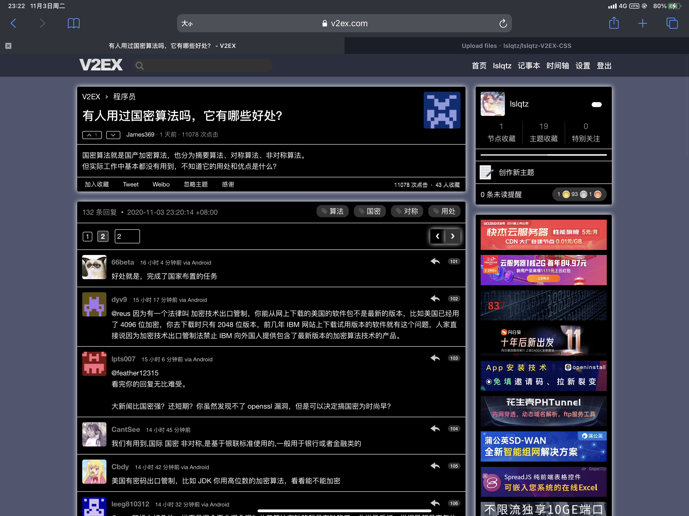
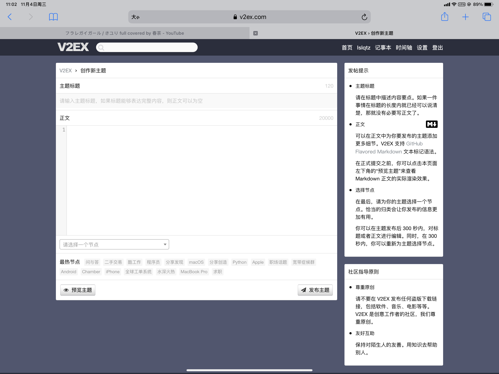
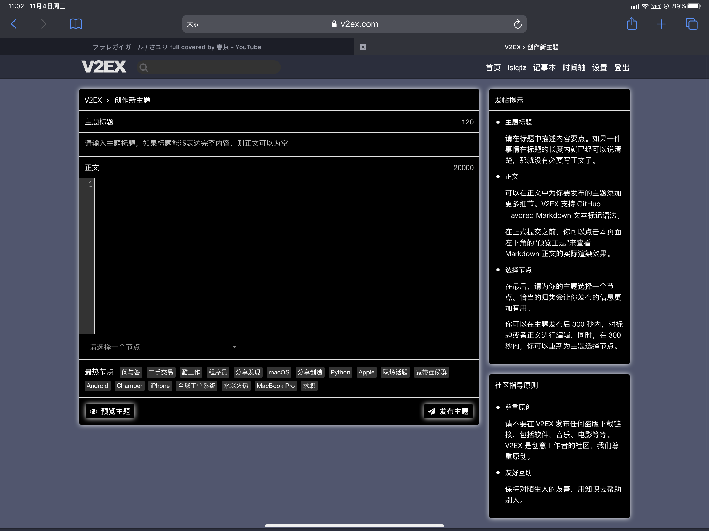
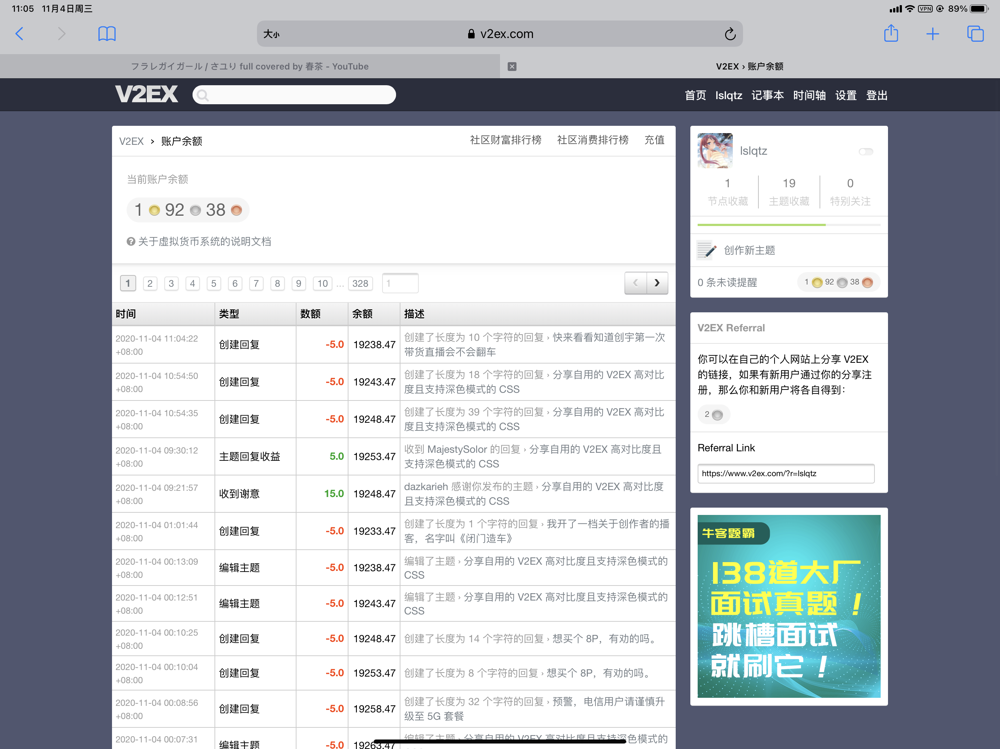
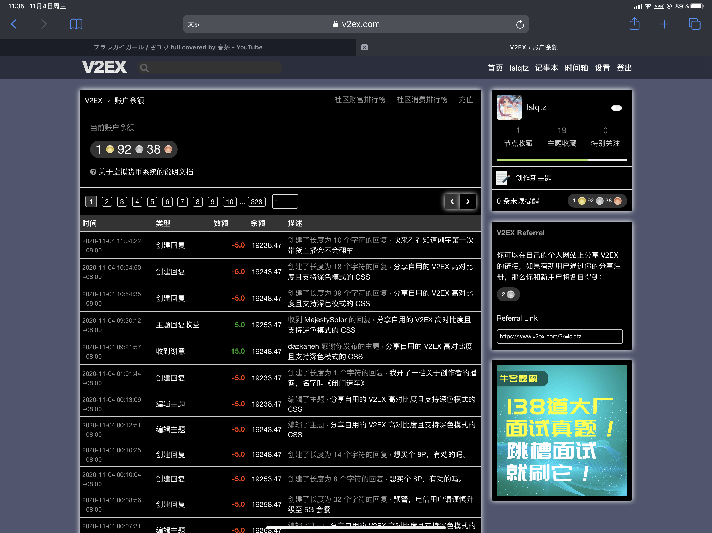

# lslqtz-V2EX-CSS
[Dark mode support table](https://caniuse.com/prefers-color-scheme)

## Preview
### HomePage Light

### HomePage Dark

### Thread Light

### Thread Dark

### Create thread Light

### Create thread Dark

### Account balance Light

### Account balance Dark

